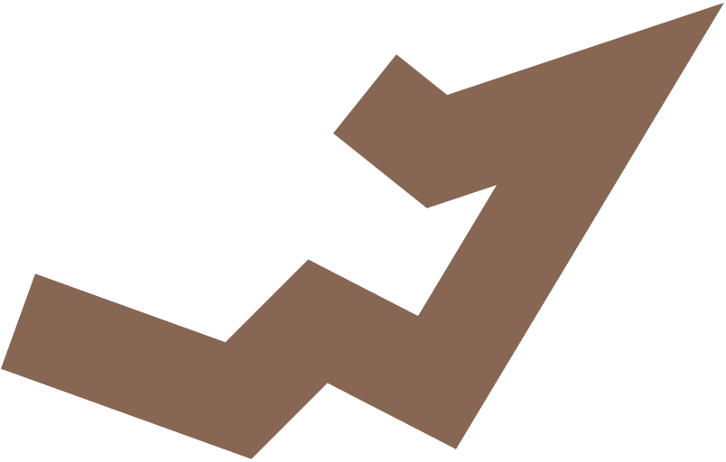

<a id="readme-top"></a>

<!-- <div align="center"> 
  <h2>MAMMI - FRONTEND</h2>
</div> -->

<!-- PROJECT LOGO -->
<br />
<div align="center">
  <a href="#">
    
  </a>

  <h2 align="center">MAMMI</h2>

  <p align="center">
    <!-- <br />
    <a href="#"><strong>Explore the docs »</strong></a>
    <br />
    <br /> -->
    <a href="http://mammi-fe-react.vercel.app/">View Demo</a>
    ·
    <a href="#">Report Bug</a>
    ·
    <a href="#">Request Feature</a>
  </p>
</div>


<!-- TABLE OF CONTENTS -->
<!-- <details>
  <summary>Table of Contents</summary>
  <ol>
    <li>
      <a href="#about-the-project">About The Project</a>
      <ul>
        <li><a href="#built-with">Built With</a></li>
      </ul>
    </li>
    <li>
      <a href="#getting-started">Getting Started</a>
      <ul>
        <li><a href="#prerequisites">Prerequisites</a></li>
        <li><a href="#installation">Installation</a></li>
      </ul>
    </li>
    <li><a href="#usage">Usage</a></li>
    <li><a href="#roadmap">Roadmap</a></li>
    <li><a href="#contributing">Contributing</a></li>
    <li><a href="#license">License</a></li>
    <li><a href="#contact">Contact</a></li>
    <li><a href="#acknowledgments">Acknowledgments</a></li>
  </ol>
</details> -->

## Built With

<p align="left">
  <a href="https://skillicons.dev">
    
  </a>
</p>

<p align="right">(<a href="#readme-top">back to top</a>)</p>

<!-- ABOUT THE PROJECT -->
# About The Project 

## Features

| `Main`        |`Admin`                    | `Customer`
| :-----------  |:------------------------- | :-----------  
| Login         | Edit Profile
| Logout        | Change & Forgot Password               
| Home          | Create & Edit Product     | Cart
|               | Create & Edit Promo       | Order
|               | Dasboard                  | Transaction (including history)
|               | Handle Transaction        | 


<p align="right">(<a href="#readme-top">back to top</a>)</p>

## Sign Up


## Sign In / Login


## Home


## Product


## Forgot Password


## History Customer


## Product Detail Customer


## Profile


## Payment And Delivery


<p align="right">(<a href="#readme-top">back to top</a>)</p>

<!-- GETTING STARTED -->
# Getting Started

<!-- 
## Prerequisites
-->

## Installation

1. Clone the repo
   ```sh
   git clone https://github.com/muhahsanarifin/mammi-fe.git
   ```

<p align="right">(<a href="#readme-top">back to top</a>)</p>


<!-- USAGE -->
<!-- # Usage

For more examples, please refer to the [Documentation](https://example.com)

<p align="right">(<a href="#readme-top">back to top</a>)</p> -->


<!-- ROADMAP -->
<!-- # Roadmap

- [x] Add Changelog
- [x] Add back to top links
- [ ] Add Additional Templates w/ Examples
- [ ] Add "components" document to easily copy & paste sections of the readme
- [ ] Multi-language Support
    - [ ] Chinese
    - [ ] Spanish -->

<!-- <p align="right">(<a href="#readme-top">back to top</a>)</p> -->


<!-- CONTRIBUTING -->
# Contributing

 


1. Fork the Project
2. Create your new Branch ( `git checkout -b ...` )
3. Commit your Changes ( `git commit -m '...'` )
4. Push to the Branch ( `git push origin ...` )
5. Open a Pull Request


<p align="right">(<a href="#readme-top">back to top</a>)</p>


<!-- CONTACT -->
<!-- # Contact

Your Name - []() -->

<!-- <p align="right">(<a href="#readme-top">back to top</a>)</p> -->


<p align="center"> <samp><i>&copy; 2022 mammi</i></samp> </p>